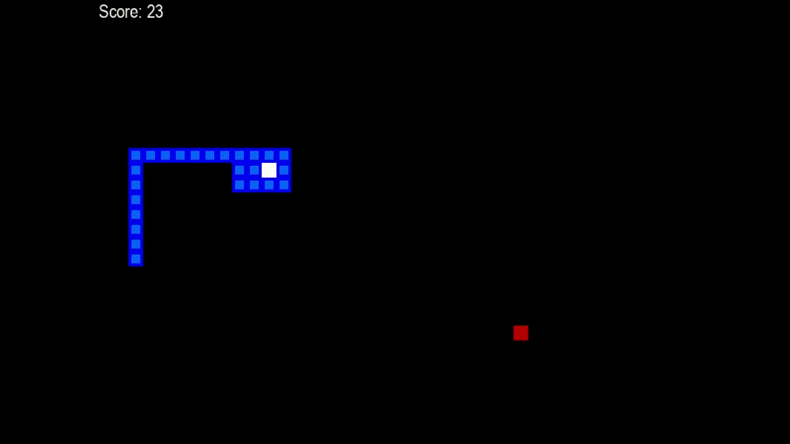

#  AI Learns to Play Snake

This project is an implementation of the **NEAT (NeuroEvolution of Augmenting Topologies)** algorithm to train a neural network to play the classic **Snake Game**.



---

##  Usuage

###  Clone the repository:

```bash
git clone https://github.com/your-username/neat-snake-ai.git
cd neat-snake-ai
```

###  Run the project:

```bash
# For Version 1
python SnakeV1.py

# For Version 2
python SnakeV2.py
```

You'll be prompted to enter a mode:

```
> Type 'train' to train a new model
> Type 'demo' to run the pretrained best genome
```

---

## Gameplay Interface

The AI sees the world in a minimal format and reacts with simple choices:

### **Inputs:**

* Danger straight
* Danger left
* Danger right
* Food straight
* Food left
* Food right
* *(+ Last output → only in Version 2)*

### **Outputs:**

* `[1, 0, 0]` → Go straight
* `[0, 1, 0]` → Turn left
* `[0, 0, 1]` → Turn right

---

##  Project Versions

###  Version 1: Stateless Snake

No memory of the past, just pure reaction.

#### V1.1 – Classic

* `-10` for dying
* `+0.1` per time step
* `+10` per apple
* Max Score: **98**
* 50+ Score Achieved at Gen: **168**

#### V1.2 – Brutally Honest

* `-100` for dying
* Rewards unchanged
* Max Score: **94**
* 50+ Score Achieved at Gen: **92**

#### V1.3 – The Greedy Genius

* `+100` per apple
* `+0.1` per time step
* Final fitness: `(score^2) × 10`
* Max Score: **52**
* 50+ Score Achieved at Gen: **311**

#### V1.4 – Strategic Vision

* `+10` per apple
* `+0.1` per time step
* No penalty for death
* Reward/Penalty for change in distance to food: `±0.5 × Δdist`
* Max Score: **65**
* 50+ Score Achieved at Gen: **337**

---

###  Version 2: Memory Matters

The snake remembers its last move. Just enough memory to be dangerous.

#### V2.1 – With a Hint of Memory

* `-10` for dying
* `+0.1` per time step
* `+10` per apple
* Max Score: **67**
* 50+ Score Achieved at Gen: **237**

#### V2.2 – Distance-Aware & Determined

* `+10` per apple
* `+0.1` per time step
* No penalty for death
* Reward/Penalty based on `±0.5 × Δdist`
* Max Score: **74**
* 50+ Score Achieved at Gen: **384**

---

## Performance Metrics

Each run tracks:

* Generation
* Best Fitness
* Max Apples Eaten
* Fitness History (Plotted with matplotlib)

The training results vary heavily depending on fitness function design — a small tweak can make or break evolution.

---

##  Tech Stack

* **Python**
* **Pygame** – For rendering the snake game
* **NEAT-Python** – Evolutionary training
* **Matplotlib** – Plotting training progress
* **Pickle** – Saving top-performing genomes

---

## Learnings

* NEAT can evolve strong strategies even with minimal inputs.
* Reward shaping is **crucial** — a good scoring rule accelerates evolution.
* Adding simple memory (like last move) gives big gains in behavior consistency.

> Evolution isn't perfect. But give it enough generations and even a snake becomes a strategist.

---
