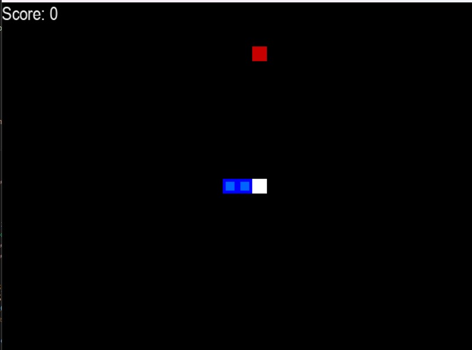

# AI Learns to Play Snake

## Overview

This project demonstrates how an AI learns to play the classic Snake game using the **NEAT (NeuroEvolution of Augmenting Topologies)** algorithm. The AI evolves over generations to optimize its gameplay strategy, becoming better at avoiding collisions and growing its length.

## Features

- Interactive Snake game built using **Pygame**.
- AI-controlled Snake that learns through **genetic evolution**.
- Visualization of the learning process, including the fitness score and evolution progress.
- Modular design for easy experimentation with AI parameters and game logic.

## Requirements

To run this project, ensure you have the following installed:

- Python 3.8 or later
- Pygame
- NEAT-Python

### Installing Dependencies

Use the following command to install required packages:

```bash
pip install pygame neat-python
```

## How It Works

1. **Game Environment**:
   - The Snake game is implemented using Pygame, where the snake moves around a grid, eats food, and grows in size.
   - The game ends when the snake collides with itself or the walls.

2. **AI Learning Process**:
   - The NEAT algorithm initializes a population of neural networks.
   - Each neural network (AI agent) controls a Snake and receives inputs such as:
     - Snake's position relative to food.
     - Distance to walls.
     - Snake's body positions.
   - The fitness score is calculated based on the Snake's performance (e.g., survival time and food eaten).
   - Over generations, the NEAT algorithm evolves the neural networks to optimize gameplay.

3. **Visualization**:
   - The game visually shows how the AI plays, highlighting its learning progress.
   - Fitness scores and generation numbers are displayed on the screen.

## Project Structure

```
Snake-game/
├── README.md                      # Project documentation
├── Snake.py                       # Snake game logic implementation
├── config-feedforward.txt         # Configuration file for NEAT parameters
└── requirements.txt               # List of dependencies
```

## Usage

1. Clone this repository:

   ```bash
   git clone https://github.com/ankraj1234/Snake-game.git
   cd Snake-game
   ```

2. Run the project:

   ```bash
   python Snake.py
   ```
   
3. Watch the AI learn to play Snake! Each generation improves its gameplay strategy.

## Configuration

You can adjust the NEAT parameters in the `config.txt` file. Key parameters include:

- **Population size**: Determines the number of neural networks per generation.
- **Fitness function**: Defines how performance is evaluated.
- **Mutation rate**: Controls how often neural networks are altered during evolution.

Refer to the [NEAT-Python documentation](https://neat-python.readthedocs.io/) for more details.

## Results

- Over time, the AI demonstrates improved strategies, such as avoiding walls and optimizing paths to food.
- Fitness scores increase with each generation, showcasing the learning process.

## Screenshots



## Future Improvements

- Add more complex game mechanics (e.g., obstacles).
- Implement deep reinforcement learning for comparison with NEAT.
- Enhance visualizations for better insight into AI behavior.

## Acknowledgments

- [NEAT-Python](https://github.com/CodeReclaimers/neat-python): The library used for the NEAT algorithm.
- [Pygame](https://www.pygame.org/): For building the Snake game environment.

## Contributing

Contributions are welcome! Feel free to submit issues or pull requests to enhance the project.
